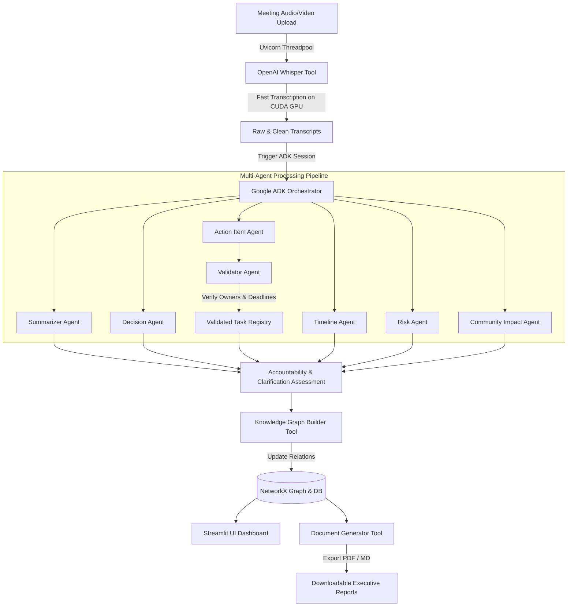

# ActionSync AI

> **From Conversations to Accountability**

ActionSync AI is an AI-powered, enterprise-grade Meeting Intelligence Platform. It converts raw organizational conversations (meetings, standups, discussions) into structured, validated execution blueprints—decisions, tasks, risks, and timelines—using a multi-agent workflow coordinated by the **Google ADK (Agent Development Kit)** and powered by **Gemini 2.5**.

Unlike standard summary chatbots, ActionSync AI acts as an active accountability orchestrator, verifying commitment levels, mapping dependencies, and generating audit-ready PDF/Markdown reports.

---

## 📌 The Problem
Modern organizations conduct hundreds of meetings daily, but face a set of universal challenges:
* **Forgotten Decisions**: Strategic choices made during discussions are rarely logged centrally.
* **Vague Accountability**: Tasks are assigned loosely without clear owners or realistic deadlines.
* **Information Silos**: Institutional knowledge is lost in long, unindexed audio recordings.
* **Invisible Risks**: Critical dependencies and blockers discussed in passing go unmitigated.

## 💡 The Solution
ActionSync AI automatically processes meeting audio/video recordings and implements a structured, multi-agent pipeline:
1. **High-Speed Transcription**: Extracts spoken text using hardware-accelerated OpenAI Whisper.
2. **Multi-Agent Decomposition**: Passes transcripts through nine specialized Google ADK agents for parallel analysis (extracting summaries, items, timelines, risks, and cultural impact).
3. **Structured Validation**: Employs a Validator Agent to ensure extracted action items have explicit owners, dates, and realistic deadlines.
4. **Relational Mapping**: Automatically builds an organizational knowledge graph mapping entities, relationships, and dependencies.
5. **Interactive Dashboard**: Exposes real-time task analytics, risk distributions, and search capabilities.

---

## 🛠️ Technology Stack

* **Orchestration & Agents:** Google ADK (Agent Development Kit)
* **AI Model Engine:** Gemini 2.5 Flash / Pro
* **Backend API:** FastAPI (Python 3.11)
* **Frontend Interface:** Streamlit (Custom Glassmorphism styling)
* **Speech Transcription:** OpenAI Whisper (CUDA-optimized GPU acceleration)
* **Translation Service:** Bhashini Translation API (for multilingual inputs)
* **Database & ORM:** SQLite (Dev) / PostgreSQL (Prod) with SQLAlchemy
* **Knowledge Graph:** NetworkX (Relational Entity Mapping)

---

## 📐 Platform Architecture

The diagram below illustrates the flow from raw meeting audio/video uploads to structured organizational knowledge and reports:



---

## 📂 Project Structure & Documentation Guides

For in-depth explanations of individual sub-systems, consult our detailed developer guides inside [docs/](file:///g:/Projects/Mini-Projects/ActionSync%20AI/ActionSync-AI/docs/):

1. 📖 **[Installation Guide](file:///g:/Projects/Mini-Projects/ActionSync%20AI/ActionSync-AI/docs/installation.md)**: Details on FFmpeg setup, system paths, and virtual environments.
2. 📐 **[Architecture Guide](file:///g:/Projects/Mini-Projects/ActionSync%20AI/ActionSync-AI/docs/architecture.md)**: Agent-to-Agent communication protocols, memory designs, and pipelines.
3. 📂 **[Folder Structure Guide](file:///g:/Projects/Mini-Projects/ActionSync%20AI/ActionSync-AI/docs/folders.md)**: Structural mapping and responsibilities of directories.
4. 🔌 **[API Router Reference](file:///g:/Projects/Mini-Projects/ActionSync%20AI/ActionSync-AI/docs/api.md)**: REST endpoints for auth, uploads, dashboard metrics, and report extraction.
5. 🤖 **[ADK Agents Manual](file:///g:/Projects/Mini-Projects/ActionSync%20AI/ActionSync-AI/docs/agents.md)**: Prompts, validation rules, and schema definitions for the nine agents.
6. 🛠️ **[Developer Customization Manual](file:///g:/Projects/Mini-Projects/ActionSync%20AI/ActionSync-AI/docs/developer.md)**: Running tests, writing custom tools, and modifying agents.
7. 🐳 **[Docker & Production Deployment Guide](file:///g:/Projects/Mini-Projects/ActionSync%20AI/ActionSync-AI/docs/deployment.md)**: Running multi-container services and PostgreSQL migrations.

---

## 🚀 Setup & Installation Instructions

### 1. Clone & Initialize Environment
Clone the repository, verify that Python 3.11 is installed, and create a virtual environment:
```powershell
python -m venv venv
```

Activate the virtual environment:
* **Windows (PowerShell):**
  ```powershell
  .\venv\Scripts\activate
  ```
* **macOS/Linux:**
  ```bash
  source venv/bin/activate
  ```

### 2. Install Dependencies (Preserving GPU/CUDA Support)
If you have a dedicated GPU with PyTorch CUDA installed globally, initialize the virtual environment to utilize system site-packages, or reinstall PyTorch with CUDA wheels in your virtual environment:
```powershell
pip install --extra-index-url https://download.pytorch.org/whl/cu121 torch torchaudio torchvision
pip install -r requirements.txt
```

> [!IMPORTANT]
> Ensure **FFmpeg** is installed and added to your system's `PATH` variables. Whisper requires FFmpeg to decode audio and video file formats.

### 3. Configure Credentials
Copy `.env.example` to `.env` and fill in your details:
```powershell
cp .env.example .env
```
Ensure your `GEMINI_API_KEY` is set inside the `.env` file.

### 4. Running the Platform

#### Start the FastAPI Backend Server
```powershell
python -m uvicorn backend.main:app --reload --host 0.0.0.0 --port 8000
```
*The API Interactive documentation (Swagger UI) is available at [http://localhost:8000/docs](http://localhost:8000/docs).*

#### Start the Streamlit Frontend Web App
```powershell
streamlit run frontend/app.py --server.port 8501 --server.address 0.0.0.0
```
*The Web Dashboard is accessible at [http://localhost:8501](http://localhost:8501).*

---

## 🧪 Developer & Quality Verification

### Run the Test Suite
Ensure that everything is integrated correctly by running the `pytest` suite (isolated to a separate test database file to preserve development data):
```powershell
python -m pytest tests/ -W ignore
```

### Profile GPU Transcription Speed & VRAM
Run our custom GPU profiler script to measure model load times, CUDA VRAM consumption, and transcribing speeds:
```powershell
python scratch/test_whisper_gpu.py "path/to/your/audio_or_video.mp4" --model base
```
